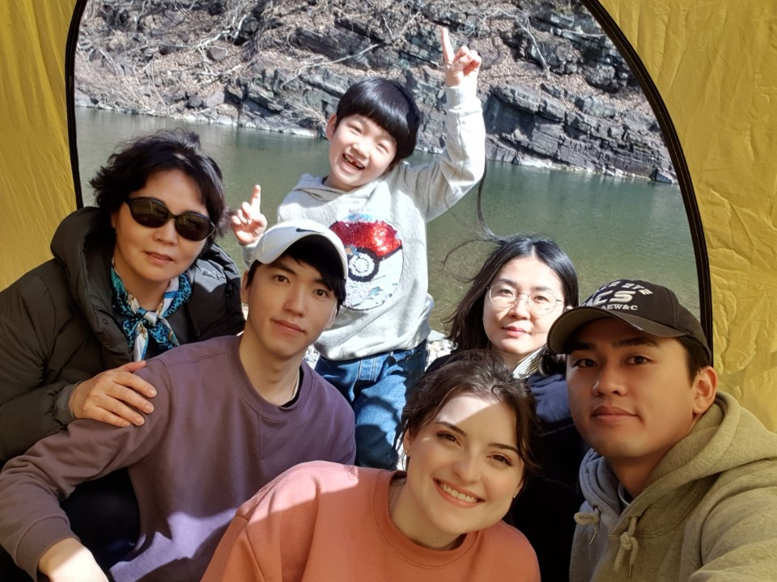

# I am Geonhyeok Jeong from South Korea.

Graduated from Pusan National University as Second seat in Statistics. I served my country for around 10 years including my high school period as a master sergeant.

Recently, I came to US to get married to my beloved wife, Sophia. 

I got the admission from UNC chapel hill statistics and operational research in Fall 2022.

