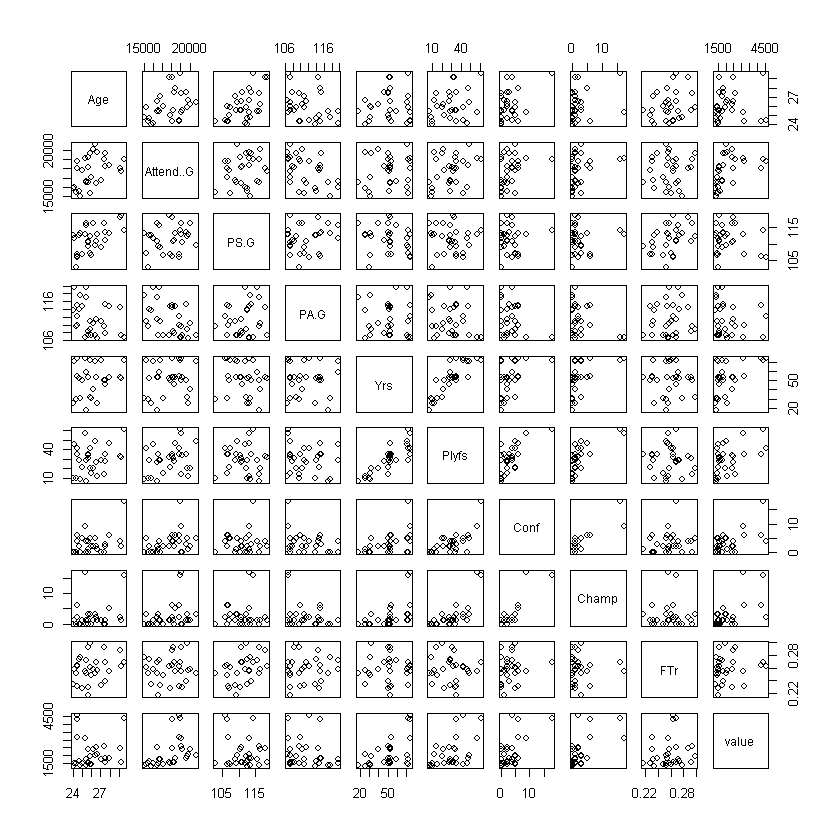
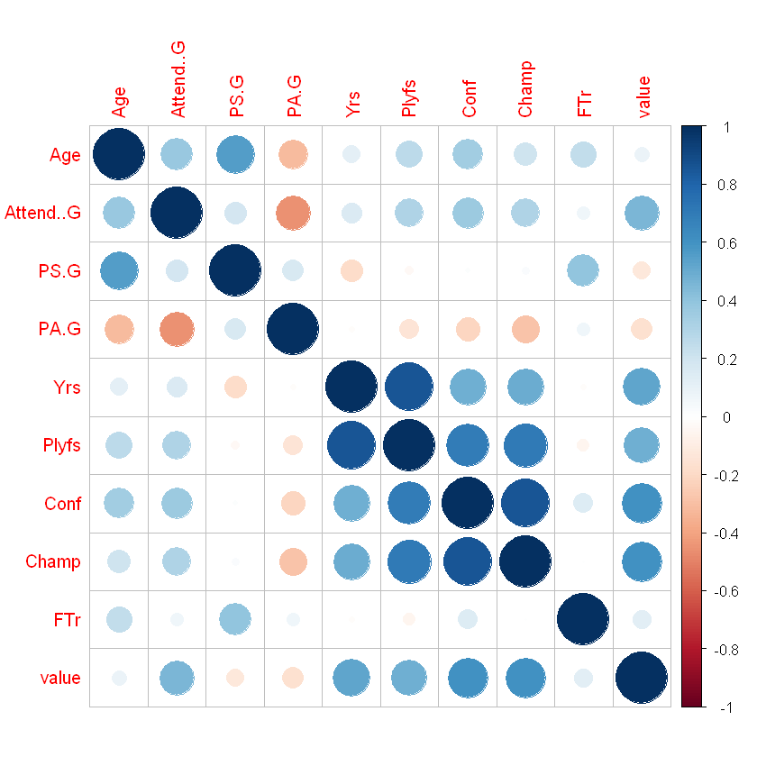
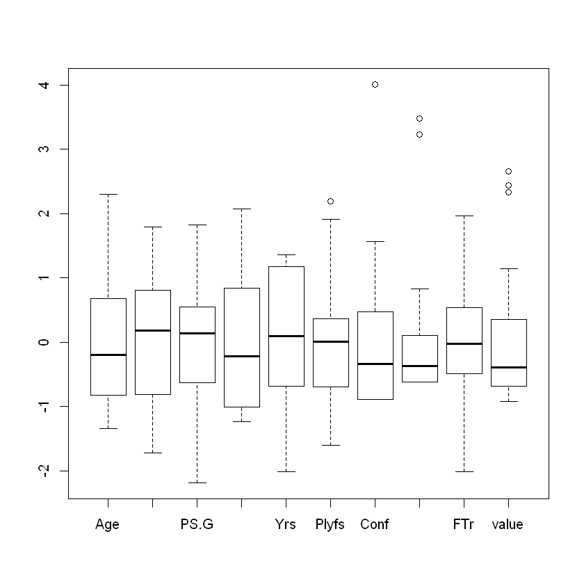
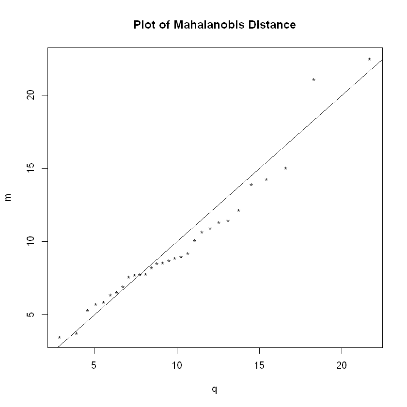
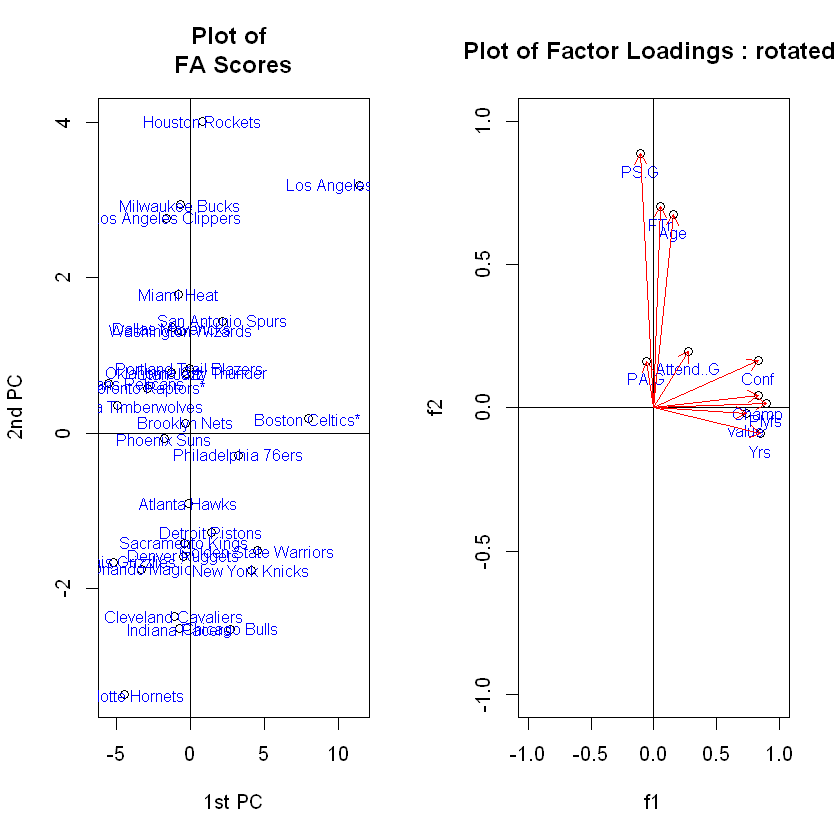
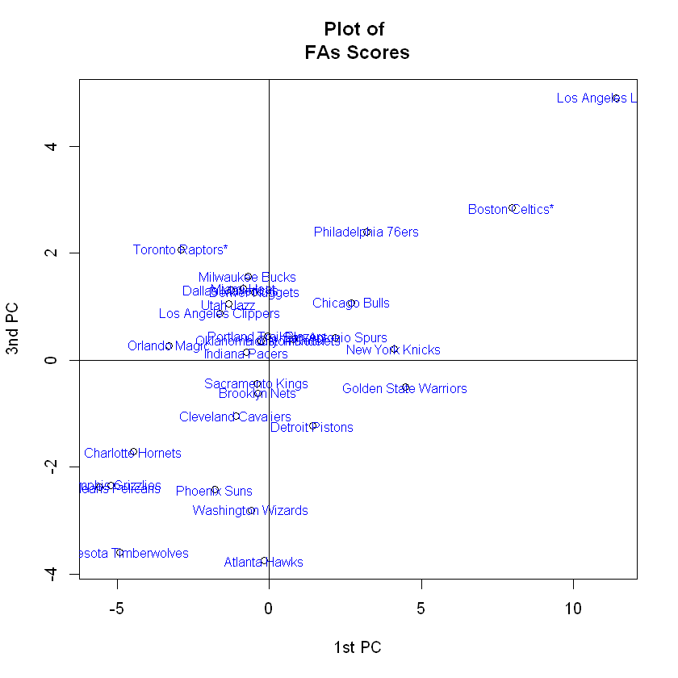
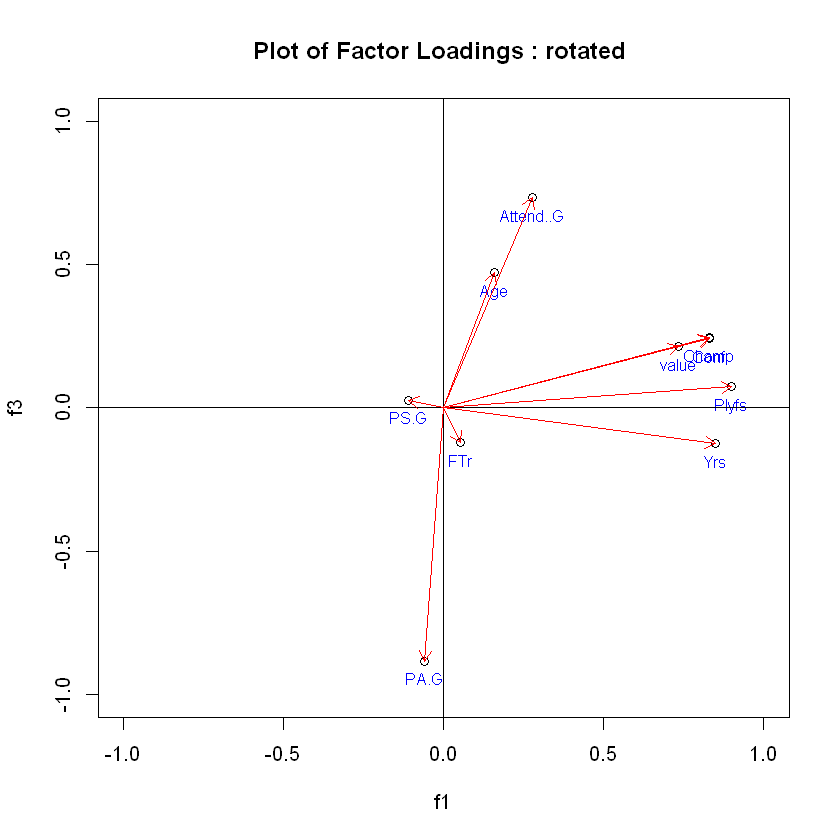
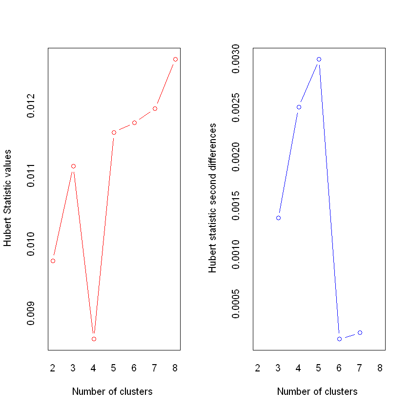
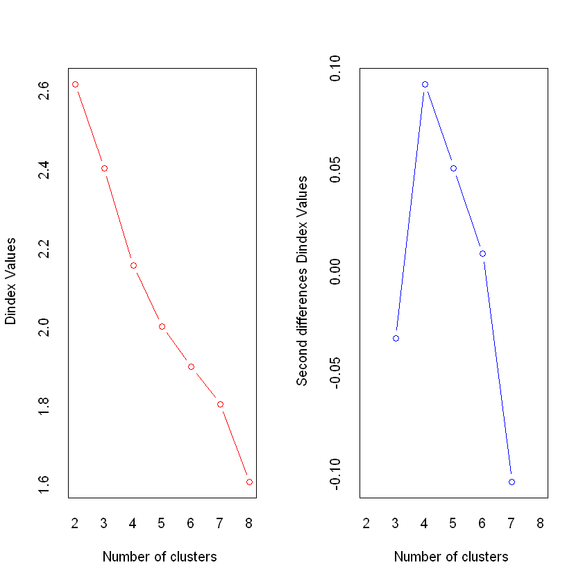

#  Seasonal league rank by team based on multivariate.

## Ⅰ. Abstract
The NBA has overtaken football as the most popular American sport. Everyone has heard of Michael Jordan at least once. From the standpoint of enjoying the NBA, which team will win the regular league this time? There was always the question of which team would be last. Let us take a look at what factors affect league rankings through this multivariate analysis.

## Ⅱ. Introduction
FOOTBALL may be the most popular in the United States, but in the world, the NBA is more popular than football. Everyone has heard of the names Michael Jordan, LeBron James, and Stephen Curry at least once. In terms of enjoying the NBA, which team will perform well this year? Before the start of the league, I asked the question of how many places my favorite team will be placed in. Although ranking is determined by in-game performance, aren't there variables that affect team ranking in non-match factors as well? This data analysis was conducted to get an answer to the question. FA and CA were used as analysis methods.


## Ⅲ. Data Description
variate | description 
-------|-----------  
age    | average age of teamplayesr
Attend.G | average of participants
PS.G | average of scores per game
PA.G | average of loses per game
Yrs | team tenure
Plyfs | the number of playoffs
Conf | the number of conference finals
Champ | the number of final win
FTr | the rate of free throw per game
value | the value of team(million dollars)


```R
#install.packages('biotools')
#install.packages('MVN')
#install.packages('psych')
#install.packages('NbClust')
#install.packages('cluster')
#install.packages('corrplot')

library(corrplot)
library(biotools)
library(MVN)
library(psych)
library(NbClust)
library(cluster)
```


```R
data = read.csv('NBA.csv',header=T)
X = data[,-c(1,2,13,14)]
head(X)
rownames(X) = data[,2]
```


<table>
<thead><tr><th scope=col>Age</th><th scope=col>Attend..G</th><th scope=col>PS.G</th><th scope=col>PA.G</th><th scope=col>Yrs</th><th scope=col>Plyfs</th><th scope=col>Conf</th><th scope=col>Champ</th><th scope=col>FTr</th><th scope=col>value</th></tr></thead>
<tbody>
	<tr><td>29.2 </td><td>17771</td><td>118.6</td><td>107.4</td><td>52   </td><td>32   </td><td> 2   </td><td> 1   </td><td>0.263</td><td>1580 </td></tr>
	<tr><td>29.6 </td><td>18997</td><td>114.3</td><td>106.9</td><td>72   </td><td>61   </td><td>18   </td><td>16   </td><td>0.268</td><td>4400 </td></tr>
	<tr><td>27.4 </td><td>19068</td><td>116.2</td><td>109.7</td><td>50   </td><td>14   </td><td> 0   </td><td> 0   </td><td>0.293</td><td>2600 </td></tr>
	<tr><td>26.6 </td><td>19796</td><td>113.0</td><td>106.5</td><td>25   </td><td>12   </td><td> 1   </td><td> 1   </td><td>0.256</td><td>2100 </td></tr>
	<tr><td>26.2 </td><td>20062</td><td>116.4</td><td>110.3</td><td>40   </td><td>21   </td><td> 2   </td><td> 1   </td><td>0.257</td><td>2400 </td></tr>
	<tr><td>25.3 </td><td>19090</td><td>113.0</td><td>106.8</td><td>74   </td><td>57   </td><td> 9   </td><td>17   </td><td>0.255</td><td>3100 </td></tr>
</tbody>
</table>


```R
## data description
#str(X)
#boxplot(X)
Z <- scale(X)
#boxplot(Z)
cov(X)
sum(diag(cov(X)))
cor(X)

```


<table>
<thead><tr><th></th><th scope=col>Age</th><th scope=col>Attend..G</th><th scope=col>PS.G</th><th scope=col>PA.G</th><th scope=col>Yrs</th><th scope=col>Plyfs</th><th scope=col>Conf</th><th scope=col>Champ</th><th scope=col>FTr</th><th scope=col>value</th></tr></thead>
<tbody>
	<tr><th scope=row>Age</th><td>  2.361712644</td><td> 9.175770e+02</td><td>   3.32550575</td><td>-1.955414e+00</td><td> 2.947471e+00</td><td>   5.8535632 </td><td>   1.92390805</td><td> 1.290460e+00</td><td> 0.0077163218</td><td>   124.349425</td></tr>
	<tr><th scope=row>Attend..G</th><td>917.577011494</td><td> 2.505597e+06</td><td>1162.41839080</td><td>-2.885997e+03</td><td> 4.041149e+03</td><td>6918.1609195 </td><td>2129.91954023</td><td> 1.983333e+03</td><td> 2.2334022989</td><td>669086.264368</td></tr>
	<tr><th scope=row>PS.G</th><td>  3.325505747</td><td> 1.162418e+03</td><td>  15.28240230</td><td> 2.585621e+00</td><td>-1.174563e+01</td><td>  -1.7878161 </td><td>   0.14459770</td><td> 4.042529e-01</td><td> 0.0311197701</td><td>  -443.374713</td></tr>
	<tr><th scope=row>PA.G</th><td> -1.955413793</td><td>-2.885997e+03</td><td>   2.58562069</td><td> 1.598010e+01</td><td>-1.065172e+00</td><td>  -8.2027586 </td><td>  -3.16344828</td><td>-4.748621e+00</td><td> 0.0055875862</td><td>  -621.300000</td></tr>
	<tr><th scope=row>Yrs</th><td>  2.947471264</td><td> 4.041149e+03</td><td> -11.74563218</td><td>-1.065172e+00</td><td> 2.757023e+02</td><td> 202.1632184 </td><td>  29.81149425</td><td> 3.443563e+01</td><td>-0.0044091954</td><td>  8007.735632</td></tr>
	<tr><th scope=row>Plyfs</th><td>  5.853563218</td><td> 6.918161e+03</td><td>  -1.78781609</td><td>-8.202759e+00</td><td> 2.021632e+02</td><td> 201.7057471 </td><td>  36.10574713</td><td> 4.135402e+01</td><td>-0.0164045977</td><td>  6367.195402</td></tr>
	<tr><th scope=row>Conf</th><td>  1.923908046</td><td> 2.129920e+03</td><td>   0.14459770</td><td>-3.163448e+00</td><td> 2.981149e+01</td><td>  36.1057471 </td><td>  13.51264368</td><td> 1.311954e+01</td><td> 0.0108436782</td><td>  2059.574713</td></tr>
	<tr><th scope=row>Champ</th><td>  1.290459770</td><td> 1.983333e+03</td><td>   0.40425287</td><td>-4.748621e+00</td><td> 3.443563e+01</td><td>  41.3540230 </td><td>  13.11954023</td><td> 1.728851e+01</td><td> 0.0002712644</td><td>  2329.678161</td></tr>
	<tr><th scope=row>FTr</th><td>  0.007716322</td><td> 2.233402e+00</td><td>   0.03111977</td><td> 5.587586e-03</td><td>-4.409195e-03</td><td>  -0.0164046 </td><td>   0.01084368</td><td> 2.712644e-04</td><td> 0.0004146851</td><td>     2.420368</td></tr>
	<tr><th scope=row>value</th><td>124.349425287</td><td> 6.690863e+05</td><td>-443.37471264</td><td>-6.213000e+02</td><td> 8.007736e+03</td><td>6367.1954023 </td><td>2059.57471264</td><td> 2.329678e+03</td><td> 2.4203678161</td><td>852018.850575</td></tr>
</tbody>
</table>


3358157.39704687


<table>
<thead><tr><th></th><th scope=col>Age</th><th scope=col>Attend..G</th><th scope=col>PS.G</th><th scope=col>PA.G</th><th scope=col>Yrs</th><th scope=col>Plyfs</th><th scope=col>Conf</th><th scope=col>Champ</th><th scope=col>FTr</th><th scope=col>value</th></tr></thead>
<tbody>
	<tr><th scope=row>Age</th><td> 1.00000000 </td><td> 0.37720150 </td><td> 0.55353917 </td><td>-0.31829906 </td><td> 0.11550901 </td><td> 0.26819313 </td><td> 0.34056548 </td><td> 0.201953886</td><td> 0.246568511</td><td> 0.08766085 </td></tr>
	<tr><th scope=row>Attend..G</th><td> 0.37720150 </td><td> 1.00000000 </td><td> 0.18784995 </td><td>-0.45608987 </td><td> 0.15375496 </td><td> 0.30773432 </td><td> 0.36604750 </td><td> 0.301343200</td><td> 0.069287067</td><td> 0.45793299 </td></tr>
	<tr><th scope=row>PS.G</th><td> 0.55353917 </td><td> 0.18784995 </td><td> 1.00000000 </td><td> 0.16545474 </td><td>-0.18095075 </td><td>-0.03220089 </td><td> 0.01006226 </td><td> 0.024870160</td><td> 0.390914134</td><td>-0.12287131 </td></tr>
	<tr><th scope=row>PA.G</th><td>-0.31829906 </td><td>-0.45608987 </td><td> 0.16545474 </td><td> 1.00000000 </td><td>-0.01604759 </td><td>-0.14448109 </td><td>-0.21527856 </td><td>-0.285692578</td><td> 0.068639680</td><td>-0.16837862 </td></tr>
	<tr><th scope=row>Yrs</th><td> 0.11550901 </td><td> 0.15375496 </td><td>-0.18095075 </td><td>-0.01604759 </td><td> 1.00000000 </td><td> 0.85728024 </td><td> 0.48841994 </td><td> 0.498780122</td><td>-0.013040071</td><td> 0.52247430 </td></tr>
	<tr><th scope=row>Plyfs</th><td> 0.26819313 </td><td> 0.30773432 </td><td>-0.03220089 </td><td>-0.14448109 </td><td> 0.85728024 </td><td> 1.00000000 </td><td> 0.69158734 </td><td> 0.700293184</td><td>-0.056721441</td><td> 0.48569590 </td></tr>
	<tr><th scope=row>Conf</th><td> 0.34056548 </td><td> 0.36604750 </td><td> 0.01006226 </td><td>-0.21527856 </td><td> 0.48841994 </td><td> 0.69158734 </td><td> 1.00000000 </td><td> 0.858360500</td><td> 0.144859594</td><td> 0.60699175 </td></tr>
	<tr><th scope=row>Champ</th><td> 0.20195389 </td><td> 0.30134320 </td><td> 0.02487016 </td><td>-0.28569258 </td><td> 0.49878012 </td><td> 0.70029318 </td><td> 0.85836050 </td><td> 1.000000000</td><td> 0.003203722</td><td> 0.60700546 </td></tr>
	<tr><th scope=row>FTr</th><td> 0.24656851 </td><td> 0.06928707 </td><td> 0.39091413 </td><td> 0.06863968 </td><td>-0.01304007 </td><td>-0.05672144 </td><td> 0.14485959 </td><td> 0.003203722</td><td> 1.000000000</td><td> 0.12876492 </td></tr>
	<tr><th scope=row>value</th><td> 0.08766085 </td><td> 0.45793299 </td><td>-0.12287131 </td><td>-0.16837862 </td><td> 0.52247430 </td><td> 0.48569590 </td><td> 0.60699175 </td><td> 0.607005460</td><td> 0.128764924</td><td> 1.00000000 </td></tr>
</tbody>
</table>


```R
plot(X)
```


​       


I tried to find out the correlation through the plot data above, but I could only figure out the approximate degree of correlation. So, I checked it again with the correlation matrix.


```R
X <- as.matrix(X)
dim(X)
corrplot(R,method='circle')
```


<ol class=list-inline>
	<li>30</li>
	<li>10</li>
</ol>





    


If you look at the picture above, you can easily see the correlation between the variables, and you can see that PA.G (percentage runs per game) has a negative correlation with other variables as a whole. If you look at Year (the period in which the club was created), you can see that there is a positive correlation with variables such as Plyfs, conf, Champ, value. The longer the period, the more opportunities there are, so it may be natural to have a positive relationship.


```R
boxplot(Z)
```


​    


The boxplot data above is a figure after standardizing the value of the value to a relatively large size. Overall, the mean is similar and the outliner is circled in red. Looking at the outliers, we can infer that certain teams have won a lot of conference championships.


```R
## nomality 검사
n<-dim(X)[[1]]
p<-dim(X)[[2]]
s<-cov(X)
xbar<-colMeans(X)
m<-mahalanobis(X,xbar,s)
m<-sort(m)
id<-seq(1,n)
pt<-(id-0.5)/n
q<-qchisq(pt,p)
plot(q,m,pch='*',title(main = 'Plot of Mahalanobis Distance'))
abline(0,1)
rq<-cor(cbind(q,m))[1,2]
rq

```


0.97554144303074



    


In multivariate analysis, whether the multivariate data is normal is one of the important issues. Therefore, let's examine the normality of this data material. When you look at the picture above, you can easily see that the plots are linear.
Since the value of the correlation coefficient is close to 1, it can be said that this data follows a multivariate normal distribution.


```R
## FA
R=round(cor(X),3)
eigen.R=eigen(R)
V=round(eigen.R$vectors, 3) 
gof=eigen.R$values/sum(eigen.R$values)*100 
round(gof, 2)
plot(eigen.R$values, type="b", 
main="Scree Graph", 
xlab="Component Number",
ylab="Eigenvalue")

```


<ol class=list-inline>
	<li>39.38</li>
	<li>19.02</li>
	<li>13.08</li>
	<li>8.68</li>
	<li>6.48</li>
	<li>6.13</li>
	<li>3.29</li>
	<li>2.71</li>
	<li>0.65</li>
	<li>0.58</li>
</ol>


​    


The above is the numerical data of the explanatory power of the factors and the screen plot. If we look at the above figures first, we can see that we have to select up to number 3 to have an explanatory power of 71.48%, which is 70%, and it is appropriate to get a factor of 3 because we can also see that the 3rd point is elbow through the script plot. it can be seen that


```R
pcfa<-principal(R, nfactors=3, 
rotate="varimax")
V1 = pcfa$loadings
Psi=pcfa$uniquenesses
Rm = R-(V1%*%t(V1) + diag(Psi))
round(Rm, 3)
```


<table>
<thead><tr><th></th><th scope=col>Age</th><th scope=col>Attend..G</th><th scope=col>PS.G</th><th scope=col>PA.G</th><th scope=col>Yrs</th><th scope=col>Plyfs</th><th scope=col>Conf</th><th scope=col>Champ</th><th scope=col>FTr</th><th scope=col>value</th></tr></thead>
<tbody>
	<tr><th scope=row>Age</th><td> 0.000</td><td>-0.147</td><td>-0.040</td><td>-0.001</td><td> 0.103</td><td> 0.079</td><td>-0.015</td><td>-0.074</td><td>-0.177</td><td>-0.117</td></tr>
	<tr><th scope=row>Attend..G</th><td>-0.147</td><td> 0.000</td><td> 0.023</td><td> 0.177</td><td> 0.029</td><td> 0.000</td><td>-0.074</td><td>-0.117</td><td> 0.005</td><td> 0.101</td></tr>
	<tr><th scope=row>PS.G</th><td>-0.040</td><td> 0.023</td><td> 0.000</td><td> 0.037</td><td>-0.003</td><td> 0.050</td><td>-0.051</td><td> 0.071</td><td>-0.223</td><td>-0.032</td></tr>
	<tr><th scope=row>PA.G</th><td>-0.001</td><td> 0.177</td><td> 0.037</td><td> 0.000</td><td>-0.060</td><td>-0.025</td><td> 0.022</td><td>-0.025</td><td>-0.150</td><td> 0.070</td></tr>
	<tr><th scope=row>Yrs</th><td> 0.103</td><td> 0.029</td><td>-0.003</td><td>-0.060</td><td> 0.000</td><td> 0.104</td><td>-0.172</td><td>-0.170</td><td>-0.009</td><td>-0.075</td></tr>
	<tr><th scope=row>Plyfs</th><td> 0.079</td><td> 0.000</td><td> 0.050</td><td>-0.025</td><td> 0.104</td><td> 0.000</td><td>-0.077</td><td>-0.065</td><td>-0.108</td><td>-0.190</td></tr>
	<tr><th scope=row>Conf</th><td>-0.015</td><td>-0.074</td><td>-0.051</td><td> 0.022</td><td>-0.172</td><td>-0.077</td><td> 0.000</td><td> 0.103</td><td> 0.014</td><td>-0.051</td></tr>
	<tr><th scope=row>Champ</th><td>-0.074</td><td>-0.117</td><td> 0.071</td><td>-0.025</td><td>-0.170</td><td>-0.065</td><td> 0.103</td><td> 0.000</td><td>-0.042</td><td>-0.053</td></tr>
	<tr><th scope=row>FTr</th><td>-0.177</td><td> 0.005</td><td>-0.223</td><td>-0.150</td><td>-0.009</td><td>-0.108</td><td> 0.014</td><td>-0.042</td><td> 0.000</td><td> 0.129</td></tr>
	<tr><th scope=row>value</th><td>-0.117</td><td> 0.101</td><td>-0.032</td><td> 0.070</td><td>-0.075</td><td>-0.190</td><td>-0.051</td><td>-0.053</td><td> 0.129</td><td> 0.000</td></tr>
</tbody>
</table>


```R
P1 = Z%*%V1 ## pcfa scores
P1
```


<table>
<thead><tr><th></th><th scope=col>RC1</th><th scope=col>RC2</th><th scope=col>RC3</th></tr></thead>
<tbody>
	<tr><th scope=row>Milwaukee Bucks</th><td>-0.69690498</td><td> 2.9366577 </td><td> 1.5663129 </td></tr>
	<tr><th scope=row>Los Angeles Lakers*</th><td>11.40830978</td><td> 3.1906370 </td><td> 4.9032630 </td></tr>
	<tr><th scope=row>Los Angeles Clippers</th><td>-1.62789727</td><td> 2.7615094 </td><td> 0.8769825 </td></tr>
	<tr><th scope=row>Toronto Raptors*</th><td>-2.91483148</td><td> 0.5677460 </td><td> 2.0594270 </td></tr>
	<tr><th scope=row>Dallas Mavericks</th><td>-1.26015575</td><td> 1.3557118 </td><td> 1.3082168 </td></tr>
	<tr><th scope=row>Boston Celtics*</th><td> 7.96949543</td><td> 0.1839926 </td><td> 2.8432202 </td></tr>
	<tr><th scope=row>Houston Rockets</th><td> 0.79223176</td><td> 4.0097456 </td><td> 0.3812458 </td></tr>
	<tr><th scope=row>Utah Jazz</th><td>-1.33703293</td><td> 0.7772491 </td><td> 1.0498785 </td></tr>
	<tr><th scope=row>Denver Nuggets</th><td>-0.49327721</td><td>-1.5843039 </td><td> 1.2575280 </td></tr>
	<tr><th scope=row>Oklahoma City Thunder</th><td>-0.27093861</td><td> 0.7605576 </td><td> 0.3496999 </td></tr>
	<tr><th scope=row>Miami Heat</th><td>-0.86321158</td><td> 1.7860531 </td><td> 1.3393481 </td></tr>
	<tr><th scope=row>Philadelphia 76ers</th><td> 3.20193842</td><td>-0.2919069 </td><td> 2.3917409 </td></tr>
	<tr><th scope=row>Indiana Pacers</th><td>-0.76758569</td><td>-2.5197811 </td><td> 0.1409949 </td></tr>
	<tr><th scope=row>New Orleans Pelicans</th><td>-5.57123329</td><td> 0.6382415 </td><td>-2.3811291 </td></tr>
	<tr><th scope=row>Orlando Magic</th><td>-3.30308939</td><td>-1.7572065 </td><td> 0.2679063 </td></tr>
	<tr><th scope=row>Memphis Grizzlies</th><td>-5.21346992</td><td>-1.6631311 </td><td>-2.3499228 </td></tr>
	<tr><th scope=row>Phoenix Suns</th><td>-1.79314424</td><td>-0.0750662 </td><td>-2.4237390 </td></tr>
	<tr><th scope=row>Portland Trail Blazers</th><td>-0.05701383</td><td> 0.8338505 </td><td> 0.4518526 </td></tr>
	<tr><th scope=row>Brooklyn Nets</th><td>-0.37512101</td><td> 0.1271130 </td><td>-0.6272461 </td></tr>
	<tr><th scope=row>San Antonio Spurs</th><td> 2.16412751</td><td> 1.4392254 </td><td> 0.4165013 </td></tr>
	<tr><th scope=row>Sacramento Kings</th><td>-0.40932569</td><td>-1.4188069 </td><td>-0.4394992 </td></tr>
	<tr><th scope=row>Minnesota Timberwolves</th><td>-4.93361978</td><td> 0.3499874 </td><td>-3.5942411 </td></tr>
	<tr><th scope=row>Chicago Bulls</th><td> 2.68594150</td><td>-2.5259300 </td><td> 1.0599839 </td></tr>
	<tr><th scope=row>Detroit Pistons</th><td> 1.42807795</td><td>-1.2777904 </td><td>-1.2292451 </td></tr>
	<tr><th scope=row>Washington Wizards</th><td>-0.60779126</td><td> 1.3054967 </td><td>-2.8130418 </td></tr>
	<tr><th scope=row>New York Knicks</th><td> 4.10057937</td><td>-1.7663874 </td><td> 0.2112814 </td></tr>
	<tr><th scope=row>Charlotte Hornets</th><td>-4.45833492</td><td>-3.3659443 </td><td>-1.7172388 </td></tr>
	<tr><th scope=row>Cleveland Cavaliers</th><td>-1.09924151</td><td>-2.3552744 </td><td>-1.0430173 </td></tr>
	<tr><th scope=row>Atlanta Hawks</th><td>-0.17153757</td><td>-0.9059297 </td><td>-3.7527034 </td></tr>
	<tr><th scope=row>Golden State Warriors</th><td> 4.47405619</td><td>-1.5163155 </td><td>-0.5043604 </td></tr>
</tbody>
</table>


```R
lim1 <- range(pretty(V1))
lim2 <- range(pretty(P1))
lim<-range(pretty(V1))
par(mfrow=c(1,2))
plot(P1[,1], P1[, 2], main="Plot of 
FA Scores", xlab="1st PC", ylab="2nd PC")
text(P1[,1], P1[, 2], labels=
rownames(P1), cex=0.8, col="blue")
abline(v=0, h=0)
plot(V1[,1], V1[,2],main="Plot of Factor Loadings : rotated ", xlab="f1", ylab="f2", xlim=lim, ylim=lim)
text(V1[,1], V1[, 2], labels=
rownames(V1), cex=0.8, col="blue", pos=1)
abline(v=0, h=0)
arrows(0,0, V1[,1], V1[, 2], col=2, code=2, length=0.1)

```

​    

​    


First, I will analyze the factor score plot and factor loading plot 1,2. There are a lot of teams in general, so I'll say the Lakers and the Honnets as representative of the two teams. In the case of Lakers, it can be said that it is located on the right side of the first quadrant and has both the characteristics of the first and second factors. It can be said that he has been in training for a long time, has won many championships, has a high average score, his age, and the number of audiences. On the other hand, in the case of the Honnets, which are located at the end of the third quadrant, they have little experience in winning, are young, and have a small audience. Looking at the ranks of the two teams, lakers are 2nd and honnets are 27th, showing a lot of difference.


```R
plot(P1[,1], P1[, 3], main="Plot of 
FAs Scores", xlab="1st PC", ylab="3nd PC")
text(P1[,1], P1[, 3], labels=
rownames(P1), cex=0.8, col="blue")
abline(v=0, h=0)
plot(V1[,1], V1[,3],main="Plot of Factor Loadings : rotated ", xlab="f1", ylab="f3", xlim=lim, ylim=c(-1,1))
text(V1[,1], V1[, 3], labels=
rownames(V1), cex=0.8, col="blue", pos=1)
abline(v=0, h=0)
arrows(0,0, V1[,1], V1[, 3], col=2, code=2, length=0.1)

```

​    

​    


​    


It is a picture of the 1st and 3rd factors. Since I have explained the first factor above, I will only explain the third factor. In the case of the third person, it can be seen that the more it goes to -, the higher the average number of conceded points, the smaller the audience, and the younger the age. A representative team is the Atranta Hawks, and this year's rank is 28th.


```R
mlfa<-factanal(Z, factors = 3,
rotation="varimax", score="regression")
#mlfa
Lm=mlfa$loadings
#Lm
par(mfrow=c(1,2))
lim<-range(pretty(Lm))
#plot(Lm[,1], Lm[,2],main="Plot of Factor Loadings : none ", xlab="f1", ylab="f2", xlim=lim, ylim=lim)
#text(Lm[,1], Lm[, 2], labels=
#rownames(Lm), cex=0.8, col="blue", pos=1)
#abline(v=0, h=0)
#arrows(0,0, Lm[,1], Lm[, 2], col=2, code=2, length=0.1)
P = mlfa$scores
rownames(P) = rownames(X)
# plot(P[,1], P[, 2], main="Plot of
# Factor Scores", xlab="1st PC", ylab="2nd PC")
# text(P[,1], P[, 2], labels=
# rownames(P), cex=0.8, col="blue")

```


```R
allindex<-NbClust(Z, distance=
"euclidean", min.nc = 2, max.nc = 8, 
method = "kmeans", index = "all" )
kmeans <- kmeans(P, 8) 
cluster=data.frame(X,cluster=kmeans$cluster,data[,1])
colnames(cluster) = cbind(c(colnames(X),'cluster','rank'))

```

    *** : The Hubert index is a graphical method of determining the number of clusters.
                    In the plot of Hubert index, we seek a significant knee that corresponds to a 
                    significant increase of the value of the measure i.e the significant peak in Hubert
                    index second differences plot. 


​    


​    


    *** : The D index is a graphical method of determining the number of clusters. 
                    In the plot of D index, we seek a significant knee (the significant peak in Dindex
                    second differences plot) that corresponds to a significant increase of the value of
                    the measure. 
     
    ******************************************************************* 
    * Among all indices:                                                
    * 8 proposed 2 as the best number of clusters 
    * 4 proposed 3 as the best number of clusters 
    * 3 proposed 4 as the best number of clusters 
    * 2 proposed 5 as the best number of clusters 
    * 7 proposed 8 as the best number of clusters 
    
                       ***** Conclusion *****                            
     
    * According to the majority rule, the best number of clusters is  2 


​     
    ******************************************************************* 


​    


In the factor plot, it was difficult to divide the groups subjectively because there were many overlapping teams. So, we will divide the groups through the above function and find out the characteristics of each group. According to the above result, it is best to divide two groups, but in the case of two groups, too many teams enter one group and cannot show the characteristics, so I divided the group into the next best 8 groups to show the results.


```R
C1=cluster[(cluster[,11]==1),]
C2=cluster[(cluster[,11]==2),]
C3=cluster[(cluster[,11]==3),]
C4=cluster[(cluster[,11]==4),]
C5=cluster[(cluster[,11]==5),]
C6=cluster[(cluster[,11]==6),]
C7=cluster[(cluster[,11]==7),]
C8=cluster[(cluster[,11]==8),]

C1;C2;C3;C4;C5;C6;C7;C8

```


<table>
<thead><tr><th></th><th scope=col>Age</th><th scope=col>Attend..G</th><th scope=col>PS.G</th><th scope=col>PA.G</th><th scope=col>Yrs</th><th scope=col>Plyfs</th><th scope=col>Conf</th><th scope=col>Champ</th><th scope=col>FTr</th><th scope=col>value</th><th scope=col>cluster</th><th scope=col>rank</th></tr></thead>
<tbody>
	<tr><th scope=row>Milwaukee Bucks</th><td>29.2 </td><td>17771</td><td>118.6</td><td>107.4</td><td>52   </td><td>32   </td><td>2    </td><td>1    </td><td>0.263</td><td>1580 </td><td>1    </td><td>1    </td></tr>
	<tr><th scope=row>Houston Rockets</th><td>29.1 </td><td>18077</td><td>118.1</td><td>114.4</td><td>53   </td><td>33   </td><td>4    </td><td>2    </td><td>0.287</td><td>2475 </td><td>1    </td><td>7    </td></tr>
</tbody>
</table>


<table>
<thead><tr><th></th><th scope=col>Age</th><th scope=col>Attend..G</th><th scope=col>PS.G</th><th scope=col>PA.G</th><th scope=col>Yrs</th><th scope=col>Plyfs</th><th scope=col>Conf</th><th scope=col>Champ</th><th scope=col>FTr</th><th scope=col>value</th><th scope=col>cluster</th><th scope=col>rank</th></tr></thead>
<tbody>
	<tr><th scope=row>Sacramento Kings</th><td>27.1 </td><td>16796</td><td>109  </td><td>110.9</td><td>72   </td><td>29   </td><td>0    </td><td>1    </td><td>0.232</td><td>1775 </td><td>2    </td><td>21   </td></tr>
</tbody>
</table>


<table>
<thead><tr><th></th><th scope=col>Age</th><th scope=col>Attend..G</th><th scope=col>PS.G</th><th scope=col>PA.G</th><th scope=col>Yrs</th><th scope=col>Plyfs</th><th scope=col>Conf</th><th scope=col>Champ</th><th scope=col>FTr</th><th scope=col>value</th><th scope=col>cluster</th><th scope=col>rank</th></tr></thead>
<tbody>
	<tr><th scope=row>Los Angeles Lakers*</th><td>29.6 </td><td>18997</td><td>114.3</td><td>106.9</td><td>72   </td><td>61   </td><td>18   </td><td>16   </td><td>0.268</td><td>4400 </td><td>3    </td><td>2    </td></tr>
</tbody>
</table>


<table>
<thead><tr><th></th><th scope=col>Age</th><th scope=col>Attend..G</th><th scope=col>PS.G</th><th scope=col>PA.G</th><th scope=col>Yrs</th><th scope=col>Plyfs</th><th scope=col>Conf</th><th scope=col>Champ</th><th scope=col>FTr</th><th scope=col>value</th><th scope=col>cluster</th><th scope=col>rank</th></tr></thead>
<tbody>
	<tr><th scope=row>Boston Celtics*</th><td>25.3 </td><td>19090</td><td>113.0</td><td>106.8</td><td>74   </td><td>57   </td><td>9    </td><td>17   </td><td>0.255</td><td>3100 </td><td>4    </td><td> 6   </td></tr>
	<tr><th scope=row>Chicago Bulls</th><td>24.4 </td><td>18804</td><td>106.8</td><td>109.9</td><td>54   </td><td>35   </td><td>6    </td><td> 6   </td><td>0.231</td><td>3200 </td><td>4    </td><td>23   </td></tr>
</tbody>
</table>


<table>
<thead><tr><th></th><th scope=col>Age</th><th scope=col>Attend..G</th><th scope=col>PS.G</th><th scope=col>PA.G</th><th scope=col>Yrs</th><th scope=col>Plyfs</th><th scope=col>Conf</th><th scope=col>Champ</th><th scope=col>FTr</th><th scope=col>value</th><th scope=col>cluster</th><th scope=col>rank</th></tr></thead>
<tbody>
	<tr><th scope=row>Toronto Raptors*</th><td>26.6 </td><td>19796</td><td>113.0</td><td>106.5</td><td>25   </td><td>12   </td><td>1    </td><td>1    </td><td>0.256</td><td>2100 </td><td>5    </td><td> 4   </td></tr>
	<tr><th scope=row>Dallas Mavericks</th><td>26.2 </td><td>20062</td><td>116.4</td><td>110.3</td><td>40   </td><td>21   </td><td>2    </td><td>1    </td><td>0.257</td><td>2400 </td><td>5    </td><td> 5   </td></tr>
	<tr><th scope=row>Miami Heat</th><td>25.9 </td><td>19680</td><td>112.2</td><td>108.9</td><td>32   </td><td>20   </td><td>5    </td><td>3    </td><td>0.298</td><td>1950 </td><td>5    </td><td>11   </td></tr>
	<tr><th scope=row>New Orleans Pelicans</th><td>25.4 </td><td>16505</td><td>116.2</td><td>117.0</td><td>18   </td><td> 7   </td><td>0    </td><td>0    </td><td>0.252</td><td>1350 </td><td>5    </td><td>14   </td></tr>
	<tr><th scope=row>Orlando Magic</th><td>26.0 </td><td>17093</td><td>106.4</td><td>107.3</td><td>31   </td><td>15   </td><td>2    </td><td>0    </td><td>0.248</td><td>1430 </td><td>5    </td><td>15   </td></tr>
</tbody>
</table>


<table>
<thead><tr><th></th><th scope=col>Age</th><th scope=col>Attend..G</th><th scope=col>PS.G</th><th scope=col>PA.G</th><th scope=col>Yrs</th><th scope=col>Plyfs</th><th scope=col>Conf</th><th scope=col>Champ</th><th scope=col>FTr</th><th scope=col>value</th><th scope=col>cluster</th><th scope=col>rank</th></tr></thead>
<tbody>
	<tr><th scope=row>Memphis Grizzlies</th><td>24.0 </td><td>15857</td><td>112.6</td><td>113.7</td><td>25   </td><td>10   </td><td>0    </td><td>0    </td><td>0.234</td><td>1300 </td><td>6    </td><td>16   </td></tr>
	<tr><th scope=row>Minnesota Timberwolves</th><td>24.8 </td><td>15066</td><td>113.3</td><td>117.5</td><td>31   </td><td> 9   </td><td>0    </td><td>0    </td><td>0.277</td><td>1375 </td><td>6    </td><td>22   </td></tr>
	<tr><th scope=row>Charlotte Hornets</th><td>24.3 </td><td>15428</td><td>102.9</td><td>109.6</td><td>30   </td><td>10   </td><td>0    </td><td>0    </td><td>0.252</td><td>1500 </td><td>6    </td><td>27   </td></tr>
</tbody>
</table>


<table>
<thead><tr><th></th><th scope=col>Age</th><th scope=col>Attend..G</th><th scope=col>PS.G</th><th scope=col>PA.G</th><th scope=col>Yrs</th><th scope=col>Plyfs</th><th scope=col>Conf</th><th scope=col>Champ</th><th scope=col>FTr</th><th scope=col>value</th><th scope=col>cluster</th><th scope=col>rank</th></tr></thead>
<tbody>
	<tr><th scope=row>Los Angeles Clippers</th><td>27.4 </td><td>19068</td><td>116.2</td><td>109.7</td><td>50   </td><td>14   </td><td>0    </td><td>0    </td><td>0.293</td><td>2600 </td><td>7    </td><td> 3   </td></tr>
	<tr><th scope=row>Utah Jazz</th><td>27.5 </td><td>18306</td><td>111.0</td><td>107.9</td><td>46   </td><td>28   </td><td>2    </td><td>0    </td><td>0.269</td><td>1550 </td><td>7    </td><td> 8   </td></tr>
	<tr><th scope=row>Portland Trail Blazers</th><td>27.5 </td><td>19634</td><td>113.6</td><td>115.2</td><td>50   </td><td>35   </td><td>3    </td><td>1    </td><td>0.239</td><td>1850 </td><td>7    </td><td>18   </td></tr>
	<tr><th scope=row>Brooklyn Nets</th><td>26.5 </td><td>16403</td><td>110.8</td><td>111.4</td><td>53   </td><td>27   </td><td>2    </td><td>2    </td><td>0.268</td><td>2500 </td><td>7    </td><td>19   </td></tr>
	<tr><th scope=row>San Antonio Spurs</th><td>27.9 </td><td>18351</td><td>113.2</td><td>114.9</td><td>53   </td><td>47   </td><td>6    </td><td>5    </td><td>0.254</td><td>1800 </td><td>7    </td><td>20   </td></tr>
</tbody>
</table>


<table>
<thead><tr><th></th><th scope=col>Age</th><th scope=col>Attend..G</th><th scope=col>PS.G</th><th scope=col>PA.G</th><th scope=col>Yrs</th><th scope=col>Plyfs</th><th scope=col>Conf</th><th scope=col>Champ</th><th scope=col>FTr</th><th scope=col>value</th><th scope=col>cluster</th><th scope=col>rank</th></tr></thead>
<tbody>
	<tr><th scope=row>Denver Nuggets</th><td>25.6 </td><td>19186</td><td>110.4</td><td>107.4</td><td>53   </td><td>34   </td><td>0    </td><td>0    </td><td>0.230</td><td>2400 </td><td>8    </td><td> 9   </td></tr>
	<tr><th scope=row>Oklahoma City Thunder</th><td>25.6 </td><td>18203</td><td>110.8</td><td>108.3</td><td>53   </td><td>31   </td><td>4    </td><td>1    </td><td>0.292</td><td>1575 </td><td>8    </td><td>10   </td></tr>
	<tr><th scope=row>Philadelphia 76ers</th><td>26.4 </td><td>20629</td><td>109.6</td><td>107.4</td><td>71   </td><td>49   </td><td>5    </td><td>3    </td><td>0.252</td><td>2000 </td><td>8    </td><td>12   </td></tr>
	<tr><th scope=row>Indiana Pacers</th><td>25.6 </td><td>16531</td><td>109.3</td><td>107.4</td><td>53   </td><td>35   </td><td>1    </td><td>3    </td><td>0.217</td><td>1525 </td><td>8    </td><td>13   </td></tr>
	<tr><th scope=row>Phoenix Suns</th><td>24.7 </td><td>15606</td><td>112.6</td><td>113.9</td><td>52   </td><td>29   </td><td>2    </td><td>0    </td><td>0.273</td><td>1625 </td><td>8    </td><td>17   </td></tr>
	<tr><th scope=row>Detroit Pistons</th><td>25.9 </td><td>15294</td><td>107.2</td><td>110.8</td><td>72   </td><td>42   </td><td>5    </td><td>3    </td><td>0.261</td><td>1450 </td><td>8    </td><td>24   </td></tr>
	<tr><th scope=row>Washington Wizards</th><td>25.4 </td><td>16647</td><td>115.6</td><td>119.7</td><td>59   </td><td>29   </td><td>4    </td><td>1    </td><td>0.272</td><td>1750 </td><td>8    </td><td>25   </td></tr>
	<tr><th scope=row>New York Knicks</th><td>24.5 </td><td>18812</td><td>105.8</td><td>112.3</td><td>74   </td><td>42   </td><td>4    </td><td>2    </td><td>0.263</td><td>4600 </td><td>8    </td><td>26   </td></tr>
	<tr><th scope=row>Cleveland Cavaliers</th><td>25.0 </td><td>17861</td><td>106.9</td><td>114.8</td><td>50   </td><td>22   </td><td>5    </td><td>1    </td><td>0.227</td><td>1510 </td><td>8    </td><td>28   </td></tr>
	<tr><th scope=row>Atlanta Hawks</th><td>24.1 </td><td>16043</td><td>111.8</td><td>119.7</td><td>71   </td><td>46   </td><td>0    </td><td>1    </td><td>0.258</td><td>1520 </td><td>8    </td><td>29   </td></tr>
	<tr><th scope=row>Golden State Warriors</th><td>24.4 </td><td>18064</td><td>106.3</td><td>115.0</td><td>74   </td><td>35   </td><td>6    </td><td>6    </td><td>0.264</td><td>4300 </td><td>8    </td><td>30   </td></tr>
</tbody>
</table>


```R
aggregate(cluster,by=list(kmeans$cluster),FUN=mean)
```


<table>
<thead><tr><th scope=col>Group.1</th><th scope=col>Age</th><th scope=col>Attend..G</th><th scope=col>PS.G</th><th scope=col>PA.G</th><th scope=col>Yrs</th><th scope=col>Plyfs</th><th scope=col>Conf</th><th scope=col>Champ</th><th scope=col>FTr</th><th scope=col>value</th><th scope=col>cluster</th><th scope=col>rank</th></tr></thead>
<tbody>
	<tr><td>1        </td><td>29.15000 </td><td>17924.00 </td><td>118.3500 </td><td>110.9000 </td><td>52.50000 </td><td>32.500000</td><td> 3.000000</td><td> 1.500000</td><td>0.2750000</td><td>2027.500 </td><td>1        </td><td> 4.00000 </td></tr>
	<tr><td>2        </td><td>27.10000 </td><td>16796.00 </td><td>109.0000 </td><td>110.9000 </td><td>72.00000 </td><td>29.000000</td><td> 0.000000</td><td> 1.000000</td><td>0.2320000</td><td>1775.000 </td><td>2        </td><td>21.00000 </td></tr>
	<tr><td>3        </td><td>29.60000 </td><td>18997.00 </td><td>114.3000 </td><td>106.9000 </td><td>72.00000 </td><td>61.000000</td><td>18.000000</td><td>16.000000</td><td>0.2680000</td><td>4400.000 </td><td>3        </td><td> 2.00000 </td></tr>
	<tr><td>4        </td><td>24.85000 </td><td>18947.00 </td><td>109.9000 </td><td>108.3500 </td><td>64.00000 </td><td>46.000000</td><td> 7.500000</td><td>11.500000</td><td>0.2430000</td><td>3150.000 </td><td>4        </td><td>14.50000 </td></tr>
	<tr><td>5        </td><td>26.02000 </td><td>18627.20 </td><td>112.8400 </td><td>110.0000 </td><td>29.20000 </td><td>15.000000</td><td> 2.000000</td><td> 1.000000</td><td>0.2622000</td><td>1846.000 </td><td>5        </td><td> 9.80000 </td></tr>
	<tr><td>6        </td><td>24.36667 </td><td>15450.33 </td><td>109.6000 </td><td>113.6000 </td><td>28.66667 </td><td> 9.666667</td><td> 0.000000</td><td> 0.000000</td><td>0.2543333</td><td>1391.667 </td><td>6        </td><td>21.66667 </td></tr>
	<tr><td>7        </td><td>27.36000 </td><td>18352.40 </td><td>112.9600 </td><td>111.8200 </td><td>50.40000 </td><td>30.200000</td><td> 2.600000</td><td> 1.600000</td><td>0.2646000</td><td>2060.000 </td><td>7        </td><td>13.60000 </td></tr>
	<tr><td>8        </td><td>25.20000 </td><td>17534.18 </td><td>109.6636 </td><td>112.4273 </td><td>62.00000 </td><td>35.818182</td><td> 3.272727</td><td> 1.909091</td><td>0.2553636</td><td>2205.000 </td><td>8        </td><td>20.27273 </td></tr>
</tbody>
</table>


Eight groups are divided as above, and let's look at the averaged value. The red line is the group with the highest rank, and the blue line is the group with the lowest rank. Except for this average loss, it can be seen that in all areas, it is higher than that of the low-ranked cluster.

## Ⅴ. Conclusion
We analyzed NBA data through FA and CA. As we all know that factors such as the average score and free throw attempt rate, which are variables within the game, we know that the higher the rank, the higher the rank. It seems to have an impact, but the above results show that the older team, which is often referred to as the beauty of age, is showing better results.
As the standards of the data are limited to the 2019-2020 year, it cannot be concluded that they apply to many situations, but through the above data analysis, not only in-game figures but also non-game information variables such as team value, championship history, average age, etc. I was able to see that it affects the ranking, and I think it was a good analysis opportunity to tell my team that non-match areas also need improvement if I work as a game analyst.

## Ⅵ . Reference

https://www.basketball-reference.com/leagues/NBA_2020.html

https://www.statista.com/statistics/193696/franchise-value-of-national-basketball-association-teams-in-2010/


```R

```
